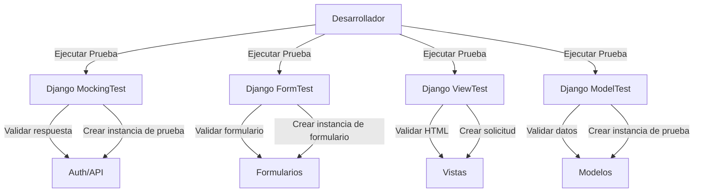

# Una Guía Completa de Testing en Django
## Introducción al Testing en Django
El testing juega un papel crucial en asegurar la integridad y fiabilidad de las aplicaciones de Django. Al probar nuestro código exhaustivamente, podemos descubrir errores, identificar problemas y verificar que nuestra aplicación se comporte como se espera. En esta sección, exploraremos por qué el testing es esencial para las aplicaciones de Django y los beneficios de adoptar un enfoque de testing exhaustivo.

### ¿Por qué probar aplicaciones?

#### Calidad de código mejorada
- Identificar y corregir errores, lo que lleva a una mayor calidad del código.
- El enfoque de Test Driven Development (TDD) asegura que el código cumpla con los requisitos y evite regresiones.
- El testing automatizado detecta problemas tempranamente, asegurando que la calidad del código se mantenga alta durante el desarrollo.

#### Fiabilidad incrementada
- El testing verifica que una aplicación Django se comporte como se espera bajo varios escenarios y entradas.
- El testing de regresión aseguran que los cambios nuevos no introduzcan errores inesperados.
- El manejo de errores y el testing de excepción hacen que la aplicación sea más robusta y confiable.

#### Experiencia de usuario mejorada
- El testing exhaustivo minimizan errores, proporcionando una experiencia de usuario más fluida.
- El testing de interfaz de usuario valida que las interacciones y flujos de trabajo del usuario funcionen correctamente.
- El performance testing asegura que la aplicación cumpla con los tiempos de respuesta y los requisitos de escalabilidad.

#### Desarrollo acelerado
- El unit testing y la automatización detectan problemas tempranamente, ahorrando tiempo en el ciclo de desarrollo.
- El enfoque TDD ayuda a diseñar código limpio y modular.
- La retroalimentación rápida del testing permite iteraciones más rápidas y ciclos de lanzamiento más ágiles.

#### Esfuerzo de mantenimiento reducido
- El testing exhaustivo reduce la necesidad de corrección constante de errores y resolución de problemas.
- El testing de regresión previene la reintroducción de errores corregidos, reduciendo el trabajo de mantenimiento.
- El testing proactivo detecta problemas tempranamente, previniendo que escalen a problemas mayores.

### La importancia del testing de aplicaciones

¿Te preguntas por qué probar las aplicaciones en primer lugar? ¡Esto te convencerá!

- **Aseguramiento de calidad**: El testing nos ayuda a identificar y solucionar problemas temprano en el proceso de desarrollo, asegurando que nuestra aplicación cumpla con los estándares de calidad deseados.
- **Detección de errores**: A través del testing, podemos descubrir errores y fallas en nuestro código, previniendo que causen problemas en un entorno de producción.
- **Mantenibilidad del código**: Escribir tests nos obliga a escribir código modular, reutilizable y bien estructurado, facilitando su mantenimiento y mejora en nuestra aplicación Django a lo largo del tiempo.
- **Confianza en los cambios**: Con un conjunto sólido de tests, podemos realizar cambios o introducir nuevas características con confianza, sabiendo que nuestros tests detectarán cualquier regresión o comportamiento inesperado.
- **Colaboración y documentación**: Los tests sirven como documentación ejecutable, ayudando a otros desarrolladores a entender la funcionalidad prevista de nuestro código y fomentando la colaboración dentro del equipo.

### Beneficios de las tests exhaustivas
- **Cobertura de tests completa**: Los tests exhaustivas implican probar varios aspectos de nuestra aplicación Django, incluyendo tests unitarias, tests de integración y tests de extremo a extremo. Esto asegura que las diferentes capas y componentes de nuestra aplicación trabajen armoniosamente juntos.
- **Mejora de la calidad del código**: Escribir tests nos obliga a pensar críticamente sobre el comportamiento de nuestro código y los diferentes escenarios que puede encontrar. Esto conduce a un código más limpio y robusto que es menos propenso a errores.
- **Proceso de desarrollo más rápido**: Aunque escribir tests inicialmente requiera un esfuerzo adicional, finalmente acelera el proceso de desarrollo. Los tests actúan como una red de seguridad, permitiéndonos detectar problemas temprano y reduciendo el tiempo dedicado a tests manuales y depuración.
- **Integración y despliegue continuos**: Un conjunto completo de tests te permite integrar tests automatizadas en nuestro flujo de trabajo de desarrollo. Esto habilita prácticas de integración y despliegue continuos, donde los cambios se tests automáticamente, asegurando la estabilidad y confiabilidad de nuestra aplicación.

💡 **Recuerda**, las tests no son solo una tarea; son una inversión en la calidad y el éxito de tus aplicaciones Django.

## Configuración de una aplicación de Django minimalista

Para iniciar con Django, sigue estos pasos para configurar una aplicación Django minimalista:

1. **Instalación de Django utilizando pip:**

    ```bash
    pip install django
    ```

2. **Creación de un nuevo proyecto Django:**

    ```bash
    django-admin startproject myproject
    ```

3. **Cambio al directorio del proyecto:**

    ```bash
    cd myproject
    ```

4. **Creación de una aplicación de Django dentro del proyecto:**

    ```bash
    python manage.py startapp myapp
    ```

5. **Estructura del Proyecto:**
    - `manage.py`: Una utilidad de línea de comandos para interactuar con el proyecto.
    - `myproject/`: El paquete del proyecto que contiene archivos de configuración y ajustes.
    - `myproject/settings.py`: Configuración para el proyecto Django.
    - `myproject/urls.py`: Configuración de URL para el proyecto.
    - `myproject/wsgi.py`: Punto de entrada de la aplicación WSGI para implementación en producción.

6. **Estructura de la Aplicación:**
    - `myapp/models.py`: Define los modelos de datos para la aplicación Django.
    - `myapp/views.py`: Contiene las vistas (lógica del controlador) para la aplicación.
    - `myapp/urls.py`: Maneja la asignación de URL para la aplicación.

Con esta aplicación Django minimalista configurada, puedes comenzar a construir tu proyecto Django definiendo modelos, escribiendo vistas y configurando URL.


## Configuración del entorno de testing
Cuando se trata de desarrollar aplicaciones Django robustas y fiables, es esencial configurar un entorno de testing adecuado. Un entorno bien configurado te permite validar eficazmente tu código, detectar posibles errores tempranamente y garantizar la calidad general de la aplicación. A continuación, encontrarás los pasos necesarios para configurar un entorno de tests para tus proyectos en Django.

### Instalación y configuración de un frameworks de testing
Para comenzar, debes identificar un framework de tests adecuado que se ajuste a los requisitos de tu proyecto. Los pasos involucrados en la instalación y configuración de un framework como pytest son los siguientes:


Instala el paquete pytest usando pip:
```bash
pip install pytest
```

Crea un directorio llamado "tests" en la raíz de tu proyecto Django para almacenar tus archivos de test:
```bash
mkdir tests
```

Dentro del directorio "tests", crea un archivo de test llamado "test_example.py":
```python
def test_example():
    assert 1 + 1 == 2
```

Ahora, puedes ejecutar el test utilizando el comando pytest:
```bash
pytest
```

### Creando un conjunto de tests separado
Es importante organizar tus test en módulos o paquetes separados para mantener un conjunto estructurado y manejable. Por ejemplo, crea un paquete de tests llamado myapp_tests dentro del directorio de tests:
```bash
mkdir tests/myapp_tests
```

Dentro del paquete myapp_tests, cree un módulo de testing llamado test_models.py:
```python
from django.test import TestCase
from myapp.models import MyModel

class MyModelTestCase(TestCase):
    def test_something(self):
        # Test your model here
        pass
```

De manera similar, puedes crear módulos de testing adicionales para diferentes componentes o funcionalidades de tu aplicación Django.

### Configuración de bases de datos para testing
Para garantizar el aislamiento y evitar interferencias con tus datos de desarrollo o producción, es recomendable configurar una base de datos separada para los tests. Configura la base de datos de testing en tu proyecto Django como se muestra a continuación:

Abre el archivo de configuración de tu proyecto Django (settings.py) y define una base de datos separada para las pruebas:

```python
DATABASES = {
    'default': {
        'ENGINE': 'django.db.backends.postgresql',
        'NAME': 'miapp_dev',
        'USER': 'miapp_user',
        'PASSWORD': 'miapp_password',
        'HOST': 'localhost',
        'PORT': '5432',
    },
    'test': {
        'ENGINE': 'django.db.backends.postgresql',
        'NAME': 'miapp_test',
        'USER': 'miapp_user',
        'PASSWORD': 'miapp_password',
        'HOST': 'localhost',
        'PORT': '5432',
    }
}
```

Cuando ejecutas pruebas, Django utiliza automáticamente la base de datos de pruebas. Ejecuta tus pruebas de la siguiente manera:

```bash
python manage.py test
```

Siguiendo estos pasos, podrás configurar un entorno de pruebas adecuado para tus aplicaciones en Django, lo que te permitirá escribir y ejecutar pruebas de manera efectiva, garantizando la integridad y calidad de tu base de código.



## Pruebas unitarias en Django
Las pruebas unitarias desempeñan un papel crucial en garantizar la confiabilidad y funcionalidad de las aplicaciones de Django. Al escribir y organizar pruebas unitarias, puedes validar el comportamiento de componentes individuales como modelos, vistas y formularios. Aquí, profundizaremos en cómo escribir pruebas unitarias efectivas para modelos, vistas y formularios de Django.

### Pruebas de modelos
Las pruebas de modelos se centran en verificar la corrección de tus modelos de Django. Esto implica probar varios aspectos, incluyendo la validación de campos, interacciones con la base de datos y métodos del modelo. Al escribir pruebas de modelos, puedes asegurarte de que tus modelos de datos funcionen según lo esperado.

Para ilustrar, consideremos un ejemplo mínimo donde creamos un modelo de Person:
```python
from django.db import models

class Person(models.Model):
    first_name = models.CharField(max_length=100)
    last_name = models.CharField(max_length=100)

    def get_full_name(self):
        return f"{self.first_name} {self.last_name}"
```
En tus tests unitarias para modelos, puedes cubrir escenarios como la validación de las longitudes de los campos, probar los métodos personalizados del modelo y verificar los datos almacenados en la base de datos.

### Pruebas de vistas

Las pruebas de vistas se centran en validar el comportamiento de las vistas de Django. Esto incluye probar el estado de la respuesta, el contenido y cualquier lógica empresarial asociada. Al escribir pruebas de vistas, puedes asegurarte de que tus vistas estén renderizando las plantillas correctas, devolviendo las respuestas HTTP esperadas y manejando los datos de entrada de manera apropiada.

Considera un ejemplo de vista mínima:
```python
from django.shortcuts import render
from django.views import View

class MyView(View):
    def get(self, request):
        return render(request, 'myapp/mytemplate.html')
```

En tus tests unitarias para vistas, puedes cubrir escenarios como verificar la plantilla renderizada, probar el código de estado de respuesta y verificar el comportamiento de la vista para diferentes métodos de solicitud.

### Pruebas de formularios
Las tests de formularios se centran en validar el comportamiento y las reglas de validación de tus formularios de Django. Esto implica probar envíos de formularios, validación de campos y manejo de errores. Al escribir tests de formularios, puedes asegurarte de que tus formularios manejen correctamente la entrada del usuario y devuelvan mensajes de error apropiados cuando sea necesario.

Considera un ejemplo simple de formulario:

```python
from django import forms

class MyForm(forms.Form):
    name = forms.CharField(max_length=100)
    email = forms.EmailField()

    def clean_name(self):
        name = self.cleaned_data.get('name')
        if name == 'admin':
            raise forms.ValidationError("Name cannot be 'admin'")
        return name
```
En tus tests unitarias para formularios, puedes cubrir escenarios como la validación de los campos del formulario, probar el envío del formulario con datos válidos e inválidos y verificar los mensajes de error.

Al escribir tests unitarias completas para modelos, vistas y formularios, puedes garantizar la corrección y robustez de los componentes individuales de la aplicación de Django. Django proporciona herramientas y afirmaciones de prueba poderosas para simplificar el proceso de prueba, lo que te permite escribir tests claras y mantenibles.

## Uso de herramientas y afirmaciones de prueba de Django
Django proporciona un conjunto completo de herramientas y afirmaciones de prueba que facilitan la escritura de tests unitarias efectivas para tus aplicaciones de Django. Estas herramientas y afirmaciones ayudan a configurar casos de prueba, hacer afirmaciones sobre el comportamiento de tu código y manejar tareas comunes de prueba. Aquí hay algunas características clave de las herramientas de prueba de Django:

- Clase TestCase: La clase TestCase de Django proporciona una base para escribir casos de prueba. Configura una base de datos limpia para cada prueba, proporciona afirmaciones específicas de prueba y maneja operaciones de prueba comunes, como ejecutar los métodos setUp() y tearDown().
- Cliente de prueba: La clase Client de Django te permite simular solicitudes HTTP y probar el comportamiento de tus vistas. Puedes usar el cliente para realizar solicitudes, afirmar códigos de estado y contenido de respuesta, manejar cookies y sesiones, y más.
- Base de datos de prueba: Django crea automáticamente una base de datos de prueba separada durante las ejecuciones de prueba. Esto garantiza que tus tests no interfieran con tus bases de datos de desarrollo o producción. Puedes configurar la configuración de la base de datos de prueba en el archivo de configuración de tu proyecto Django.
- Datos de prueba: Los datos de prueba proporcionan una forma de cargar datos en tu base de datos de prueba antes de ejecutar las tests. Puedes definir datos de prueba en varios formatos (como JSON, XML o YAML) para poblar la base de datos con datos de prueba. Esto te permite probar tu código contra escenarios realistas de datos.

Las herramientas y afirmaciones de prueba de Django facilitan la escritura de tests unitarias exhaustivas y confiables para tus aplicaciones de Django. Al aprovechar estas herramientas, puedes configurar casos de prueba de manera efectiva, hacer afirmaciones sobre el comportamiento de tu código y garantizar la corrección de los componentes de la aplicación.

### Simulando de Dependencias y Servicios Externos
En las tests unitarias, a menudo es necesario aislar su código de dependencias externas y servicios para centrarse únicamente en el comportamiento del código bajo prueba. La simulación le permite reemplazar estas dependencias con objetos ficticios o comportamientos simulados, lo que le permite controlar el entorno de prueba y simular diferentes escenarios. Aquí hay algunas técnicas para simular dependencias y servicios externos en tests de Django:

- Simulación de Funciones y Métodos: El módulo unittest.mock en Python proporciona utilidades para simular funciones y métodos. Puede usar este módulo para reemplazar llamadas a funciones externas o invocaciones de métodos con valores de retorno o comportamientos predefinidos.
- Simulación de Llamadas a API Externas: Cuando su código interactúa con APIs externas, puede utilizar bibliotecas de simulación como requests-mock o httpretty para simular las respuestas de la API. Esto le permite simular diferentes escenarios de API y asegurarse de que su código maneje las respuestas correctamente.
- Simulación de Consultas a la Base de Datos: En Django, puede utilizar los métodos assertNumQueries y assertQuerysetEqual de la clase TestCase para afirmar la cantidad de consultas a la base de datos ejecutadas y los resultados esperados. Al controlar las consultas a la base de datos en sus tests, puede aislar su código de las dependencias de la base de datos.

La simulación de dependencias y servicios externos es crucial para escribir tests unitarias enfocadas y confiables. Al reemplazar las dependencias con objetos simulados controlados o comportamientos simulados, puede probar su código de manera aislada y verificar su comportamiento en diferentes escenarios.

## Técnicas de Pruebas de Integración
### Pruebas de Vistas y Plantillas de Django con Datos Realistas
Las tests de integración te permiten probar la interacción entre diferentes componentes de la aplicación Django, como vistas, plantillas y los datos subyacentes. Al simular escenarios del mundo real, puedes asegurarte de que estos componentes funcionen juntos como se espera. Aquí tienes algunas técnicas para probar la integración de vistas y plantillas de Django:

Preparación de Datos de Prueba: Antes de probar tus vistas y plantillas, debes configurar datos de prueba realistas. Utiliza el ORM de Django o los mecanismos de carga de datos para poblar tu base de datos de prueba con datos relevantes para el escenario de prueba específico.
```python
from django.test import TestCase
from myapp.models import Product

class MyViewTestCase(TestCase):
    def setUp(self):
        Product.objects.create(name='Product A', price=10.99)
        Product.objects.create(name='Product B', price=19.99)
```

Simulación de Peticiones: Utiliza la clase Client de Django para simular peticiones HTTP e interactuar con tus vistas. Puedes realizar peticiones GET, POST u otros tipos de peticiones y afirmar el código de respuesta, el contenido y otros datos relevantes.
```python
coderesponse = self.client.get('/myview/')
self.assertEqual(response.status_code, 200)
self.assertContains(response, 'Product A')
```

Pruebas de Plantillas: Para verificar que tus plantillas se rendericen correctamente, puedes usar el motor de renderizado de plantillas de Django para renderizar la plantilla con los datos de prueba y luego afirmar la salida esperada.
```python
from django.template import engines

def test_my_template(self):
    template = engines['django'].from_string(
        '{{ product.name }}'
    )
    rendered = template.render({'products': Product.objects.all()})
    self.assertInHTML('Product A', rendered)
    self.assertInHTML('Product B', rendered)
```
Las tests de integración de vistas y plantillas aseguran que los diversos componentes de la aplicación Django funcionen armoniosamente, produciendo los resultados esperados y brindando una experiencia de usuario fluida.

## Interacción con Bases de Datos e Integraciones de Terceros
Las tests de integración a menudo implican interacciones con bases de datos e integraciones de terceros, como API externas o servicios. Para asegurar la corrección de estas interacciones, puedes emplear diversas técnicas:

1. Gestión de Bases de Datos de Prueba: Django crea automáticamente una base de datos de prueba separada durante las tests de integración. Esto aísla tus tests de tus datos de desarrollo o producción. Utiliza esta base de datos de prueba para realizar consultas, insertar datos o validar el comportamiento de tu código.

    ```python
    from django.test import TestCase
    from myapp.models import Product

    class MyIntegrationTestCase(TestCase):
        def test_database_interaction(self):
            # Perform database operations and assertions
            products = Product.objects.all()
            self.assertEqual(len(products), 2)
    ```

2. Simulación de Integraciones Externas: Cuando interactúas con API externas o servicios, puedes simular las respuestas utilizando bibliotecas como requests-mock o httpretty. Esto te permite simular diferentes escenarios de la API y verificar que tu código maneje las respuestas correctamente.

    ```python
    import requests
    import requests_mock

    def test_integración_externa(self):
        with requests_mock.Mocker() as mocker:
            mocker.get('https://api.ejemplo.com/datos', text='{"clave": "valor"}')
            respuesta = requests.get('https://api.ejemplo.com/datos')
            self.assertEqual(respuesta.json(), {"clave": "valor"})
    ```

## Pruebas de Autenticación, Autorización y Permisos
Las tests de integración son una excelente oportunidad para validar el comportamiento de las rutas de código relacionadas con la autenticación, autorización y permisos. Pruebe escenarios con diferentes roles de usuario y permisos para asegurarse de que su aplicación los maneje correctamente.

```python
class MyAuthTestCase(TestCase):
    def test_authenticated_user_can_access_protected_view(self):
        # Create a test user with appropriate permissions
        user = User.objects.create_user(username='testuser', password='testpass')
        user.user_permissions.add(Permission.objects.get(codename='view_protected_view'))

        # Log in the test user
        self.client.login(username='testuser', password='testpass')

        # Access the protected view
        response = self.client.get('/protected-view/')

        # Assert that the response status code is 200 (OK)
        self.assertEqual(response.status_code, 200)

    def test_unauthenticated_user_cannot_access_protected_view(self):
        # Attempt to access the protected view without authentication
        response = self.client.get('/protected-view/')

        # Assert that the response status code is 403 (Forbidden)
        self.assertEqual(response.status_code, 403)
```

En la clase MyAuthTestCase, tenemos dos métodos de prueba. El primer método, test_authenticated_user_can_access_protected_view, prueba si un usuario autenticado con los permisos necesarios puede acceder a una vista protegida. Creamos un usuario de prueba con los permisos adecuados, iniciamos sesión con el usuario utilizando self.client.login y luego realizamos una solicitud a la vista protegida utilizando self.client.get. Finalmente, afirmamos que el código de estado de la respuesta es 200, lo que indica un acceso exitoso.

El segundo método, test_unauthenticated_user_cannot_access_protected_view, prueba si a un usuario no autenticado se le deniega el acceso a la vista protegida. Realizamos una solicitud a la vista protegida sin iniciar sesión y afirmamos que el código de estado de la respuesta es 403, lo que indica un acceso prohibido.

Al escribir tests de integración para autenticación, autorización y permisos, puede asegurarse de que su aplicación Django maneje correctamente el acceso de los usuarios basado en sus roles y permisos, proporcionando un entorno seguro y controlado para sus usuarios.


## Pruebas de Extremo a Extremo con Selenium
Las tests de extremo a extremo (E2E) son un aspecto crítico del desarrollo de software que garantiza la integración fluida y el funcionamiento de varios componentes en un escenario del mundo real. En el contexto de las aplicaciones Django, las tests de E2E con Selenium le permiten simular interacciones de usuario y validar el comportamiento de extremo a extremo de su aplicación. Las tests de extremo a extremo son una técnica que prueba el flujo completo de una aplicación, simulando interacciones reales del usuario desde el principio hasta el final. Ayuda a identificar problemas relacionados con la integración de diferentes componentes, asegurando que la aplicación funcione como se espera en un entorno similar al de producción.

### Configuración de Selenium WebDriver para Aplicaciones Django
- Instalar Selenium WebDriver: Use pip para instalar el paquete Selenium y el controlador adecuado para su navegador (por ejemplo, ChromeDriver para Google Chrome).
- Configurar Selenium en Django: En la configuración de su proyecto Django, agregue la configuración necesaria para Selenium, especificando la ruta del controlador y otras configuraciones.
- Escribir Pruebas de Extremo a Extremo para Simular Interacciones de Usuario:
    - Identificar los escenarios que desea probar: Determine las interacciones clave del usuario o flujos de trabajo que desea cubrir en sus tests de E2E.
    - Configurar elementos de prueba y datos: Prepare los datos necesarios y los elementos de prueba para configurar el estado inicial de la aplicación para las tests.
    - Inicializar Selenium WebDriver: Cree una instancia del WebDriver y configure cualquier configuración deseada (por ejemplo, maximizar la ventana del navegador).
    - Navegar a la página deseada: Utilice los métodos del WebDriver para navegar a la URL o página donde comienza el escenario de prueba.
    - Simular interacciones de usuario: Utilice los métodos del WebDriver (por ejemplo, find_element_by_* y send_keys) para interactuar con la aplicación, introduciendo entradas, haciendo clic en botones y realizando otras acciones.
    - Afirmar resultados esperados: Utilice afirmaciones para verificar que la aplicación se comporte como se espera después de cada interacción. Puede comprobar la presencia de elementos, contenido u otros atributos relevantes.
    - Limpiar y finalizar: Después de completar el escenario de prueba, realice las tareas de limpieza necesarias (por ejemplo, eliminar datos de prueba) y cierre el WebDriver.

```python
from django.contrib.staticfiles.testing import StaticLiveServerTestCase
from selenium.webdriver.chrome.webdriver import WebDriver

class MyE2ETestCase(StaticLiveServerTestCase):
    @classmethod
    def setUpClass(cls):
        super().setUpClass()
        cls.selenium = WebDriver()

    @classmethod
    def tearDownClass(cls):
        cls.selenium.quit()
        super().tearDownClass()

    def test_user_registration_flow(self):
        # Navigate to the registration page
        self.selenium.get(self.live_server_url + '/register')

        # Enter registration details
        self.selenium.find_element_by_id('id_username').send_keys('testuser')
        self.selenium.find_element_by_id('id_email').send_keys('test@example.com')
        self.selenium.find_element_by_id('id_password1').send_keys('testpass123')
        self.selenium.find_element_by_id('id_password2').send_keys('testpass123')
        self.selenium.find_element_by_id('register-button').click()

        # Assert successful registration message
        success_message = self.selenium.find_element_by_class_name('success-message')
        self.assertEqual(success_message.text, 'Registration successful!')

        # Simulate user login
        self.selenium.find_element_by_id('id_username').send_keys('testuser')
        self.selenium.find_element_by_id('id_password').send_keys('testpass123')
        self.selenium.find_element_by_id('login-button').click()

        # Assert user is logged in
        username_displayed = self.selenium.find_element_by_class_name('username-displayed')
        self.assertEqual(username_displayed.text, 'testuser')
```

## Estrategias de Pruebas para Aplicaciones Django
### Desarrollo Guiado por Pruebas (TDD)
El desarrollo guiado por tests es un enfoque en el que las tests se escriben antes de la implementación real del código.

- Los beneficios del TDD incluyen:
    - Asegurar la corrección del código: al escribir primero las tests, defines el comportamiento deseado y luego implementas el código para satisfacer esas tests, reduciendo las posibilidades de introducir errores.
    - Mejora del diseño: el TDD fomenta un código modular y poco acoplado, lo que conduce a una mejor arquitectura de software.
    - Desarrollo más rápido: el TDD ayuda a identificar problemas temprano, lo que permite una depuración más rápida y reduce el tiempo dedicado a retrabajos.
    - Confianza en los cambios de código: con una cobertura de tests completa, puedes refactorizar o agregar nuevas características con confianza, sabiendo que tus tests detectarán cualquier regresión.

### Cobertura de Pruebas y Medición de la Calidad del Código
La cobertura de tests se refiere a la extensión a la que tu código es probado por tu conjunto de tests.

- Los beneficios de la cobertura de tests y la medición de la calidad del código incluyen:
    - Identificación de código no probado: el análisis de cobertura de tests revela áreas de tu base de código que carecen de tests adecuadas, lo que te permite llenar esos vacíos y asegurar una cobertura integral.
    - Mejora de la calidad del código: al identificar rutas de código que no están cubiertas por tests, puedes abordar posibles casos excepcionales y mejorar la calidad y confiabilidad general de tu código.
    - Orientación de los esfuerzos de desarrollo: el seguimiento de la cobertura de tests con el tiempo ayuda a rastrear el progreso y enfocar los esfuerzos de prueba en áreas que requieren más atención.
    - Promoción de las mejores prácticas: una mayor cobertura de tests anima a los desarrolladores a escribir un código más modular, testeable y mantenible.

### Integración Continua y Pipelines de Pruebas Automatizadas
La integración continua (CI) es una práctica en la que los cambios de código se integran con frecuencia en un repositorio compartido, lo que desencadena compilaciones y tests automatizadas.

Los beneficios de la CI y los pipelines de tests automatizadas incluyen:
Retroalimentación temprana: los sistemas de CI proporcionan retroalimentación inmediata sobre el impacto de los cambios de código, lo que permite a los desarrolladores abordar problemas temprano en el proceso de desarrollo.
Identificación más rápida de regresiones: las tests automatizadas se ejecutan en cada cambio de código, detectando rápidamente cualquier regresión que pueda haberse introducido.
Compilaciones consistentes y reproducibles: la CI garantiza que la aplicación pueda construirse y probarse en un entorno consistente, reduciendo las posibilidades de problemas específicos del entorno.
Colaboración y visibilidad: los sistemas de CI fomentan la colaboración al proporcionar visibilidad sobre el estado y la calidad de la base de código para todo el equipo.

Al incorporar estas estrategias de tests en tu flujo de trabajo de desarrollo Django, puedes establecer una base sólida para construir aplicaciones robustas y confiables. Desde el desarrollo guiado por tests hasta la medición de la cobertura de código e implementación de la integración continua, estas prácticas te permiten entregar software de alta calidad mientras mantienes la integridad del código y facilitas la colaboración dentro de tu equipo de desarrollo.

## Técnicas y Herramientas Avanzadas de Pruebas
Para asegurar el rendimiento óptimo, la seguridad y la usabilidad de las aplicaciones de Django, es esencial emplear técnicas avanzadas de tests y aprovechar herramientas especializadas. En esta sección, exploraremos algunas de estas técnicas y herramientas que pueden mejorar sus esfuerzos de tests y ayudarlo a entregar software de alta calidad.

### Pruebas de Rendimiento de Aplicaciones Django

Las tests de rendimiento se centran en evaluar la velocidad, la capacidad de respuesta, la escalabilidad y la estabilidad de su aplicación bajo diferentes cargas y escenarios.

Las técnicas para las tests de rendimiento incluyen:
- Pruebas de carga: Simular cargas de usuarios elevadas para identificar cuellos de botella de rendimiento y determinar la capacidad de la aplicación.
- Pruebas de estrés: Llevar la aplicación a sus límites al superar la carga esperada para evaluar su comportamiento en condiciones extremas.
- Pruebas de resistencia: Evaluar la estabilidad de la aplicación durante un período prolongado para identificar posibles fugas de memoria o problemas de consumo de recursos.

### Herramientas para tests de rendimiento de aplicaciones Django:

- Locust: Una herramienta escalable, fácil de usar y scriptable para tests de rendimiento que le permite definir escenarios de comportamiento de usuario utilizando código Python.
- Apache JMeter: Una herramienta potente y extensible basada en Java para tests de carga, capaz de simular una amplia variedad de escenarios y generar informes detallados.

## Pruebas de Seguridad y Escaneo de Vulnerabilidades

Las tests de seguridad son esenciales para identificar vulnerabilidades y asegurar la robustez de las defensas de su aplicación contra posibles amenazas.

### Las técnicas para las tests de seguridad incluyen:
- Pruebas de penetración: Simular ataques para identificar vulnerabilidades y evaluar la efectividad de las medidas de seguridad de su aplicación.
- Revisión de código: Analizar el código fuente de la aplicación para identificar posibles fallos de seguridad, como ataques de inyección o manipulación insegura de datos.
- Escaneo de seguridad: Utilizar herramientas automatizadas para escanear su aplicación en busca de vulnerabilidades comunes y configuraciones incorrectas.

### Herramientas para tests de seguridad y escaneo de vulnerabilidades:
- OWASP ZAP: Un escáner de seguridad de aplicaciones web de código abierto que ayuda a identificar vulnerabilidades comunes y proporciona informes detallados.
- Bandit: Una herramienta de análisis estático centrada en la seguridad para Python que detecta problemas comunes de seguridad en el código, como posibles vulnerabilidades o configuraciones inseguras.

## Pruebas de Exploración y Pruebas de Usabilidad

Las tests de exploración implican explorar la aplicación sin casos de prueba predefinidos para descubrir posibles problemas o áreas de mejora. Las tests de usabilidad se centran en evaluar la amigabilidad y la intuición de la interfaz de su aplicación.

### Las técnicas para las tests de exploración y usabilidad incluyen:
- Pruebas ad hoc: Explorar la aplicación desde la perspectiva del usuario, interactuar con diferentes características y funcionalidades.
- Encuestas y retroalimentación de usuarios: Recopilar comentarios de usuarios reales para obtener ideas sobre su experiencia e identificar áreas de mejora.

### Herramientas para tests de exploración y usabilidad:
- Selenium WebDriver: Una herramienta de código abierto para automatizar interacciones en navegadores, que le permite simular interacciones de usuario y realizar tests de usabilidad.
- Plataformas de prueba de usuario: Plataformas en línea que facilitan las tests de usabilidad al reclutar usuarios para proporcionar retroalimentación e ideas sobre la usabilidad de su aplicación.

Al incorporar estas técnicas avanzadas de tests y utilizar herramientas especializadas, puede elevar sus esfuerzos de tests para garantizar un rendimiento óptimo, una seguridad sólida y una usabilidad excepcional para sus aplicaciones de Django. Las tests de rendimiento, las tests de seguridad y las tests de exploración/usabilidad contribuyen conjuntamente a ofrecer una experiencia de usuario de alta calidad mientras protegen su aplicación contra posibles vulnerabilidades.


## Prácticas recomendadas y consejos para tests
### Escribir tests legibles y mantenibles
Las tests legibles y mantenibles son cruciales para el éxito a largo plazo de sus esfuerzos de prueba. Siga estas mejores prácticas para asegurarse de que sus tests sean claras, concisas y fáciles de mantener:

- Utilice nombres descriptivos para los métodos de prueba: Elija nombres significativos que describan con precisión el propósito y el comportamiento esperado de la prueba.
- Estructure sus tests de manera lógica: Organice sus tests en secciones basadas en la funcionalidad o los escenarios de prueba para mejorar la legibilidad.
- Utilice comentarios: Agregue comentarios para explicar casos de prueba complejos, resaltar detalles importantes o proporcionar contexto para los futuros mantenedores.
- Mantenga las tests centradas: Cada prueba debe centrarse en probar un solo aspecto de su aplicación, lo que facilita la identificación y corrección de problemas.
- Utilice las afirmaciones de manera efectiva: Emplee afirmaciones significativas que expresen claramente los resultados esperados de sus casos de prueba.
- Evite la duplicación innecesaria: Refactorice el código de prueba común en funciones auxiliares o accesorios reutilizables para reducir la duplicación y mejorar la mantenibilidad.


### Uso de accesorios y fábricas para datos de prueba
Los accesorios y las fábricas proporcionan una forma conveniente de crear datos de prueba para su aplicación Django. Los accesorios son conjuntos de datos predefinidos que se utilizan para llenar la base de datos de prueba. Cree accesorios utilizando el marco de trabajo de accesorios incorporado de Django o bibliotecas de terceros como Factory Boy.

```python
[
  {
    "model": "myapp.MyModel",
    "fields": {
      "name": "Test Data 1",
      "value": 42
    }
  },
  {
    "model": "myapp.MyModel",
    "fields": {
      "name": "Test Data 2",
      "value": 73
    }
  }
]
```

Cargue los accesorios en sus tests:
```python
from django.test import TestCase

class MyTestCase(TestCase):
    fixtures = ['my_fixture.json']
```

Las fábricas le permiten generar datos de prueba de manera dinámica. Utilice bibliotecas como Factory Boy para definir fábricas y generar datos realistas para sus tests.
```python
import factory

class MyModelFactory(factory.django.DjangoModelFactory):
    class Meta:
        model = MyModel

    name = factory.Faker('name')
    value = factory.Faker('random_int', min=0, max=100)
```

## Manejo de dependencias de tests y evitar la contaminación de tests
Gestionar adecuadamente las dependencias de las tests y evitar la contaminación de las tests son fundamentales para tener tests confiables y aisladas. Considera las siguientes prácticas:

- Utiliza los métodos setUp y tearDown: TestCase de Django proporciona los métodos setUp y tearDown para configurar y limpiar las dependencias de las tests, como la creación o eliminación de datos de prueba.
    ```python
    from django.test import TestCase

    class MyTestCase(TestCase):
        def setUp(self):
            # Set up test dependencies

        def tearDown(self):
            # Clean up test dependencies

    ```

- Utiliza transacciones: Django envuelve cada prueba en una transacción de base de datos, que se revierte al final de la prueba. Esto garantiza que los cambios realizados durante la prueba no afecten a otras tests ni a los datos de producción.
- Utiliza bases de datos de prueba aisladas: Configura bases de datos separadas para tus tests para evitar interferencias con los datos de desarrollo o producción.
- Evita modificaciones en el estado global: Ten precaución al modificar el estado global durante las tests, ya que puede provocar un comportamiento inesperado y contaminación de las tests. Restablece cualquier estado modificado después de cada prueba para mantener el aislamiento.
- Siguiendo estas mejores prácticas y consejos, puedes asegurarte de que tus tests sean legibles, mantenibles y fiables. Aprovechar las fixtures y factories te ayudará a crear datos de prueba realistas de manera eficiente, mientras que gestionar adecuadamente las dependencias de las tests y evitar la contaminación contribuirá a la estabilidad y precisión de tus tests.

### Integración de tests en el flujo de desarrollo:
La integración de tests en tu flujo de desarrollo te permite detectar problemas temprano, garantizar la calidad del código y proporcionar retroalimentación rápida a los desarrolladores. Considera las siguientes mejores prácticas:

- Ejecuta tests localmente: Los desarrolladores deben ejecutar regularmente tests en sus máquinas locales para detectar errores antes de confirmar el código. Utiliza corredores de tests como pytest o los comandos de gestión de tests de Django para ejecutar tus tests localmente.
Ejemplo usando pytest:
    ```bash
    pytest
    ```

- Utiliza ganchos precompromiso: Configura ganchos precompromiso para ejecutar automáticamente tests antes de confirmar cambios en el código. Esto garantiza que solo se confirmen las tests que pasen y reduce las posibilidades de introducir errores en la base de código. Ejemplo usando el marco pre-compromiso con pytest:

    ```yaml
    # .pre-commit-config.yaml
    - repo: https://github.com/pytest-dev/pytest
    rev: v6.2.4
    hooks:
    - id: pytest
    ```

- Incorpora tests en las revisiones de código: Incluye las tests como parte del proceso de revisión de código para asegurarte de que los nuevos cambios en el código tengan la cobertura de tests adecuada. Los revisores pueden verificar que las nuevas características estén correctamente probadas y alentar a los desarrolladores a abordar cualquier prueba faltante.

## Configuración de tuberías de integración continua y tests continuas

Las tuberías de integración continua (CI) y tests continuas (CT) automatizan el proceso de construcción, tests y despliegue de su aplicación. Siga estos pasos para configurar una tubería de CI/CT utilizando herramientas como GitLab CI/CD:

Configure su tubería de CI/CT: Cree un archivo ```.gitlab-ci.yml``` en la raíz de su repositorio para definir las etapas y trabajos de su tubería. Especifique los pasos necesarios para construir, probar y desplegar su aplicación Django.

Ejemplo de configuración ```.gitlab-ci.yml```:

```yml
stages:
  - build
  - test
  - deploy

build:
  stage: build
  script:
    - echo "Building the application..."

test:
  stage: test
  script:
    - echo "Running tests..."
    - pytest

deploy:
  stage: deploy
  script:
    - echo "Deploying the application..."
```

Defina el entorno de prueba: Especifique el entorno y las dependencias necesarias para ejecutar sus tests. Esto puede incluir configuraciones de base de datos, variables de entorno o servicios externos.

Ejemplo de configuración ```.gitlab-ci.yml``` con una base de datos PostgreSQL:

```yml
test:
  stage: test
  image: python:3.9
  services:
    - name: postgres:latest
      alias: db
  variables:
    POSTGRES_DB: mydatabase
    POSTGRES_USER: myuser
    POSTGRES_PASSWORD: mypassword
  script:
    - pip install -r requirements.txt
    - pytest
```

Utilice herramientas de medición de cobertura de tests: Incorpore herramientas de medición de cobertura de tests como coverage.py para hacer un seguimiento del porcentaje de código cubierto por sus tests. Genere informes de cobertura e inclúyalos en su tubería de CI/CT para tener visibilidad.

Ejemplo de configuración ```.gitlab-ci.yml``` con informes de cobertura:

```yml
test:
  stage: test
  image: python:3.9
  services:
    - name: postgres:latest
      alias: db
  variables:
    POSTGRES_DB: mydatabase
    POSTGRES_USER: myuser
    POSTGRES_PASSWORD: mypassword
  script:
    - pip install -r requirements.txt
    - coverage run --source=myapp manage.py test
    - coverage report
```

pytest: Utilice pytest como su corredor de tests para aprovechar sus amplias características, como el descubrimiento de tests, parametrización, fixtures y complementos. Escriba tests concisas y legibles utilizando la sintaxis expresiva de pytest.

Ejemplo de caso de prueba utilizando pytest:
```python
import pytest

@pytest.mark.django_db
def test_create_user():
    user = User.objects.create(username="testuser")
    assert user.username == "testuser"
```
coverage: Utilice coverage.py para medir la cobertura de tests y identificar áreas de su base de código que requieran tests adicionales. Genere informes de cobertura para evaluar la eficacia de su conjunto de tests.

Ejemplo de comando para ejecutar tests con cobertura:
```bash
coverage run --source=miaplicación manage.py test
```

GitLab CI/CD: Utilice GitLab CI/CD para automatizar sus procesos de prueba y despliegue. Configure su archivo .gitlab-ci.yml para definir las etapas y trabajos de su tubería, lo que permite una integración perfecta con su sistema de control de versiones.

Ejemplo de configuración de GitLab CI/CD:
```yml
stages:
  - build
  - test
  - deploy

# ...
```
Al integrar las tests en su flujo de trabajo de desarrollo y configurar tuberías de tests automatizadas, puede asegurarse de que sus aplicaciones Django se prueben a fondo, manteniendo una alta calidad de código y logrando una entrega de software más rápida y confiable.


## Conclusion
En esta guía integral, hemos explorado el mundo de las tests de aplicaciones Django, cubriendo una amplia gama de temas y técnicas. Recapitulemos los puntos clave que hemos abordado:
- Por qué las tests son cruciales para las aplicaciones Django, destacando los beneficios de las tests exhaustivas para garantizar la integridad y confiabilidad de sus aplicaciones.
- Configuración del entorno de tests para sus proyectos Django, incluyendo la instalación y configuración de frameworks de tests, la creación de un conjunto de tests separado y la configuración de bases de datos de prueba.
- Escritura y organización de tests unitarias para modelos, vistas y formularios de Django. Aprendimos cómo aprovechar las herramientas y afirmaciones de tests de Django, así como cómo simular dependencias y servicios externos.
- Integración de técnicas de tests, centrándonos en las tests de vistas y plantillas de Django con datos realistas, la interacción con bases de datos e integraciones de terceros, y el manejo de autenticación, autorización y permisos en tests de integración.
- Pruebas de extremo a extremo con Selenium, discutiendo su importancia y proporcionando orientación sobre la configuración de Selenium WebDriver para aplicaciones Django. También exploramos cómo escribir tests de extremo a extremo para simular interacciones de usuario.
- Técnicas y herramientas avanzadas de tests, incluyendo tests de rendimiento, tests de seguridad, exploración de vulnerabilidades, tests exploratorias y tests de usabilidad. Destacamos la importancia de estas técnicas para garantizar la solidez y confiabilidad de sus aplicaciones Django.
- Mejores prácticas para escribir tests legibles y mantenibles, utilizando fixtures y factories para datos de prueba y manejando dependencias de prueba para evitar la contaminación de tests.
- Importancia de la automatización de tests y las tests continuas, integrando tests en el flujo de trabajo de desarrollo, configurando tuberías de integración continua y tests continuas, y utilizando herramientas como pytest, cobertura y GitLab CI/CD para tests automatizadas.
Las tests exhaustivas son una parte integral del desarrollo de Django, brindando confianza en la calidad y funcionalidad de sus aplicaciones. Siguiendo las mejores prácticas y estrategias delineadas en esta guía, puede mejorar significativamente la confiabilidad, mantenibilidad y escalabilidad de sus proyectos Django.

## ¿Qué sigue?
Las tests son un viaje continuo y siempre hay más que aprender y explorar. Aquí hay algunos pasos que puede seguir para mejorar aún más sus habilidades y conocimientos de tests:

- Profundice en el marco de tests de Django y explore sus características avanzadas, como las tests de middleware, señales y ejecutores de tests personalizados.
- Manténgase actualizado con las últimas bibliotecas de tests, herramientas y mejores prácticas en las comunidades de Django y Python.
- Experimente con diferentes enfoques y técnicas de tests, como tests basadas en propiedades, tests de fuzz o tests de mutación, para descubrir más casos límite y problemas potenciales.
- Explore temas adicionales relacionados con las tests, como la optimización de rendimiento, tests de carga, tests de API o tests móviles, según las necesidades específicas de sus proyectos.
- Participe en las vibrantes comunidades de Django y tests, participe en discusiones y comparta sus experiencias y conocimientos con otros.

Recuerde, las tests no se trata solo de encontrar errores; se trata de construir software confiable, mantenible y de alta calidad. Adopte la mentalidad de tests y permita que las tests sean una parte integral de su proceso de desarrollo de Django. ¡Felices tests!
